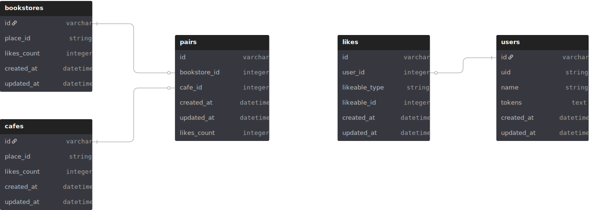

## サービス概要

本アプリケーションは、**本屋とその周辺のカフェを一度に検索できる「ほんカフェマップ」**です。
「読書のあとにくつろげるカフェを探したい」「立ち寄る書店の近くで作業したい」というニーズに応えます。

## 開発の背景

外出先で時間が空いたときに、本屋に立ち寄ることがよくあります。
「気に入った本があれば、このまま近くのカフェで読みたい」と思っても、通常のマップアプリでは本屋とカフェを別々に検索する必要があり、ルートが定まらず結局行かないことがありました。
このように、“本屋 → カフェ” の流れが自然につながる導線がないことに不便さを感じ、本屋とカフェをペアで探せるアプリを作ろうと考えました。

## アプリURL

https://bookstore-cafe-map.pages.dev

※会員登録なしでご利用いただけます。

※会員限定の画面や機能は以下のテストユーザーをご利用ください。

テストユーザー：

```text
ID: testuser1
PW: Test123456789
```

## Qiita記事

以下のQiita記事にて詳しい開発背景について記載しております。ぜひご覧ください。

準備中

## 機能一覧

### **ユーザー機能**

- サインアップ（メール認証あり）・ログイン・ログアウト
- マイページ（プロフィール確認）
- パスワードリセット

### **検索機能**

- 単体検索：本屋のみ、またはカフェのみを検索
- ペア検索：検索した本屋を起点に徒歩圏内のカフェを検索
- 現在地・キーワードからの検索
- 検索結果を地図のピンとカード一覧で表示
- カードから詳細情報ページへアクセス
- 共有リンクを生成

### **ペア機能**

- 本屋とカフェのペア作成
- ペアごとの詳細情報表示

### **いいね機能**

- 本屋・カフェ単体へのいいね
- 本屋とカフェペアへのいいね
- マイリストでカテゴリ別にいいねを確認

### **ルート表示機能**

- 各スポット詳細からワンタップで Google マップに遷移

## UIイメージ

準備中

## 使用技術

| カテゴリー | 技術名 |
| --- | --- |
| **Frontend** | React(19.0), Vite(6.3.1), React Router DOM(7.5.2), Tailwind CSS(4.1.5), DaisyUI, Heroicons, Axios,  |
| **Backend** | Ruby(3.1.6), Ruby on Rails(7.2.2), HTTParty |
| **Infrastructure** | Render（APIデプロイ）, Cloudflare Pages（フロントエンド）, Neon(DBaaS), resend（メール送信） |
| **CI/CD** | GitHub Actions |
| **Database** | PostgreSQL |
| **Environment** | Docker, Docker Compose, Node.js(22.15.0), npm |
| **Testing** | Vitest, React Testing Library, RSpec |
| **Lint / Format** | ESLint, Prettier, RuboCop |
| **Version Control** | Git, GitHub |
| **External API** | Google Places API, Google Maps JavaScript API, Google Geolocation API  |

## ER図


作成ツール：https://dbdiagram.io/home

likes は polymorphic: true で likeable_type(Bookstore, Cafe, Pair) に応じて参照先が切り替わります。

```text
- likeable_type = 'Bookstore' → likeable_id は bookstores.id を参照
- likeable_type = 'Cafe'      → likeable_id は cafes.id を参照
- likeable_type = 'Pair'      → likeable_id は pairs.id を参照
```

## インフラ構成図


作成ツール：https://app.diagrams.net/